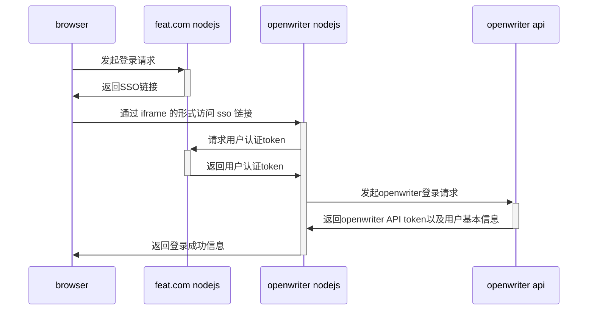

```mermaid
sequenceDiagram
  browser->>+feat.com nodejs: 发起登录请求
  feat.com nodejs->>-browser: 返回SSO链接
  browser->>+openwriter nodejs: 通过 iframe 的形式访问 sso 链接
  openwriter nodejs->>+feat.com nodejs: 请求用户认证token
  feat.com nodejs->>-openwriter nodejs: 返回用户认证token
  openwriter nodejs->>+openwriter api: 发起openwriter登录请求
  openwriter api->>-openwriter nodejs: 返回openwriter API token以及用户基本信息
  openwriter nodejs->>-browser: 返回登录成功信息
```